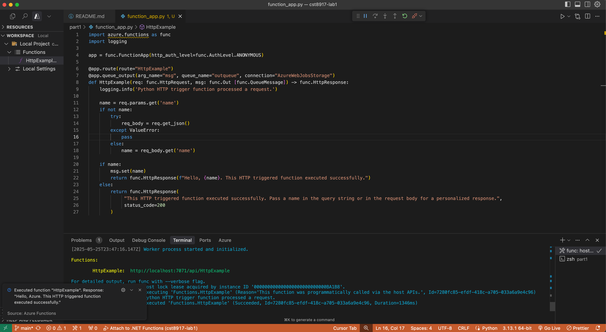
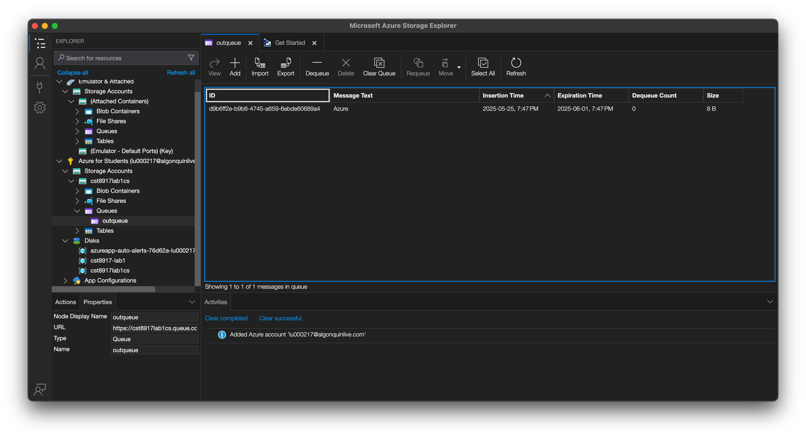
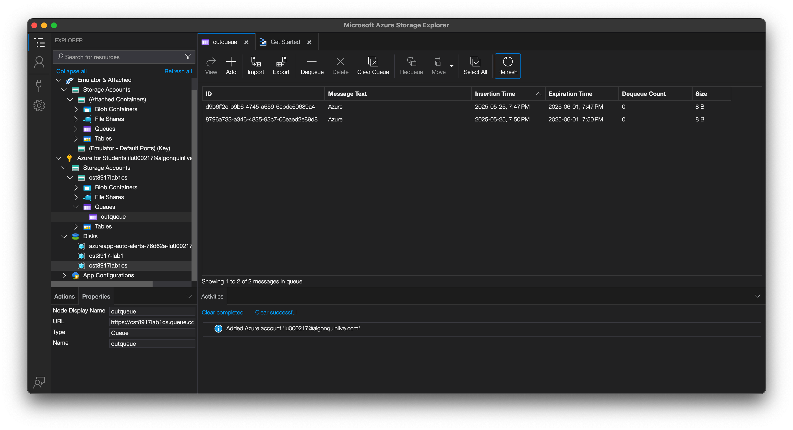

# cst8917-lab1

Demo link: https://youtu.be/XssjScvWYmc

## 1. Connect Azure Functions to Azure Storage using Visual Studio Code

### Prequest

- [Azure Storage extension](https://marketplace.visualstudio.com/items?itemName=ms-azuretools.vscode-azurestorage) for VS Code
- [Azure Storage Explorer](https://azure.microsoft.com/en-us/products/storage/storage-explorer#Download-4)
- Azure Subscription
- Finish [Quickstart: Create a C# function in Azure using Visual Studio Code](https://learn.microsoft.com/en-us/azure/azure-functions/create-first-function-vs-code-csharp)

### Downlaod function app settings

> Reference Tutorial: [Connect Azure Functions to Azure Storage using Visual Studio Code](https://learn.microsoft.com/en-us/azure/azure-functions/functions-add-output-binding-storage-queue-vs-code?pivots=programming-language-python&tabs=isolated-process#download-the-function-app-settings)

1. In vscode, press `F1` then choose `Azure Functions: Download Remote Settings...`
2. Choose the function app created in [previour tutorial](https://learn.microsoft.com/en-us/azure/azure-functions/create-first-function-vs-code-csharp)
3. You will get a `local.settings.json`, which include the credentials of Azure Storage connection string.
4. Move the `local.settings.json` file into `/part1` directory.
5. Move to `/part1` directory, activate python venv, and install dependencies.

> [!Note]  
> `Dependencies` refers to the library that python project required. Please make sure all extensions and runtime is configured properly.

### Test the function locally

6. Press `F5` to start the function.
7. Go to Side Panel > Azure > Workspace > Local Project > Functions. Right click on `HttpExample` and choose 'Execute Function Now'. Then Press `Enter` when it requests the message body.
8. Once the function triggered, you will see the message indicating function executed, with response saying `Hello Azure ...` : 

9. Open Azure Storage Explorer, and sign in with Azure account by following the prompt.
10. Goto your subscription > Storage accounts > your storage account (which created in previous tutorial) > Queues > outqueue, you should see following: 

11. Try to run the function again, and refresh the tab. Now there should be two messages: 

### Deploy the app and trigger it from cloud
12. Deploy the app

> [!Note]  
> In [official tutorial](https://learn.microsoft.com/en-us/azure/azure-functions/functions-add-output-binding-storage-queue-vs-code?pivots=programming-language-python&tabs=isolated-process#redeploy-and-verify-the-updated-app), it asked to redeploy on the original `C#` project. Which it will fail because the runtime is different since we are using `python`, and the runtime is not able to get changed.

Press `F1`, choose `Azure functions: create funtion app...`, then follow the prompts to create a new function app. Then, Press `F1` again, choose `Azure functions: deploy to function app`, then deploy to the function that you just created. In this way, we can bypass the runtime issue. Note that you must change the `AzureWebJobsStorage` located in your newly created project to the one we get in Step3.

13. Trigger the function by pressing `F1` > `Azure functions: Execute functions now` > Then follow the prompt to locate the newly deployed function.

14. Check Storage Explorer, a new message should be added.

## 2. Connect Azure Functions to Azure SQL Database using Visual Studio Code

### Prequest

> [!Important]  
> Please do not forget to clean up all the resources created during the tutorial.